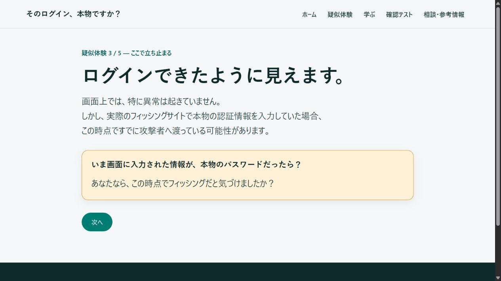

# そのログイン、本物ですか？

架空サービス「Cloud Letter」のメールとログイン画面を通じて、フィッシングを見抜く視点と、入力前に立ち止まる行動を学ぶ日本語のWebアプリです。

> 本アプリは開発中のプロトタイプです。学習体験を検証しながら、リファクタリング、UI・文言の改善、テストの拡充を継続しています。完成した教育サービスとしての有効性や、あらゆる環境での安全性を保証するものではありません。

[公開デモを体験する](https://phishing-awareness.security-learning-jp.workers.dev/)

本物のメールアドレスやパスワードを入力する必要はありません。疑似入力ボタンで、固定された架空情報だけを画面上に表示します。Cloud Letterは実在する企業・団体・サービスとは関係ありません。



疑似ログイン後の「立ち止まり」画面。画面画像は開発時点のもので、改善に伴い変更されます。

## 学習目的と体験フロー

知識を読むだけでなく、メールに急かされて操作する状況を安全に体験し、次の点を振り返れる構成を目指しています。

- 入力した瞬間に、目に見える異常が起きるとは限らない
- 正常に処理が進んだように見えても、安全とは限らない
- 入力後ではなく、入力前に送信元や接続先を確認することが重要

疑似ログインを選んだ場合は、すぐに種明かしせず、次の順序で進みます。

```text
疑似メール → 疑似ログイン → 処理中・正常に見える表示
→ 立ち止まり → 種明かし → 振り返り
```

処理中と正常に見える状態を約2秒ずつ表示したあと、立ち止まり画面で問いかけます。「次へ」を押すまでは種明かしへ進みません。実際に情報が盗まれたと断定する演出は行いません。

メールやログイン画面で安全な代替行動を選んだ場合は、処理演出を経由せず、理由の説明から振り返り・種明かしへ進めます。

### 主な機能

- 疑似メールから振り返りまでの5ステップの体験
- メールとログイン画面の怪しかった5つのポイントの解説
- 10テーマの学習コンテンツと7つの基本行動
- 5問の選択式確認テストと誤答の振り返り
- 公的機関などの公式ページを案内する相談・参考情報
- PC・モバイルのレスポンシブ表示、キーボード操作、状態変化の読み上げへの配慮

## 技術選定と設計上の工夫

Vue 3、TypeScript、Vite、Vue Router、Vue I18nを使用しています。依存関係の正確なバージョンは[package.json](package.json)と[package-lock.json](package-lock.json)に記載し、直接依存は完全なバージョンへ固定しています。

| 設計判断                   | 目的・理由                                                                                   |
| -------------------------- | -------------------------------------------------------------------------------------------- |
| フロントエンドのみで構成   | 実際の認証情報を受け取る必要がない学習体験として、認証用バックエンドやデータベースを設けない |
| 表示専用の疑似入力UI       | 実際の入力要素を使わず、ワンボタンの操作体験と、本物の認証情報を受け取らない設計を両立する   |
| 画面内の一時状態で管理     | 画面間で共有する認証状態や永続化が不要なため、Piniaを導入せずコンポーネント内で状態を扱う    |
| 文言と制御値を分離         | 日本語のみでもVue I18nで表示文言を集約し、URL・ルート名・正解IDなどは型付き設定として分ける  |
| 共通UIと画面固有処理を分離 | ボタン・見出し・通知などはpropsで文言を受け取り、体験の進行は各Viewに置く                    |
| クイズ判定をUIから分離     | 正誤判定や集計をVueに依存しない関数にし、表示とは独立してテストできるようにする              |

余白・角丸などの共通デザインは主に[src/App.vue](src/App.vue)へ集約し、アプリ全体で統一感をもたせています。

詳細は[アーキテクチャと安全設計](docs/architecture.md)を参照してください。

## 安全上の設計

- 疑似ログイン画面に`form`、`input`、`textarea`、`type="password"`を置かず、手入力・貼り付けで認証情報を受け取らない
- 疑似入力は固定された架空のメールアドレスと伏字の表示に限定し、実際の認証処理を行わない
- 疑似認証情報をAPIへ送信せず、Cookie、Web Storage、ログへ保存する処理を設けない

パスワードマネージャー対策は、HTML属性による抑制だけに頼らず、認証入力要素自体を設けない方針です。ブラウザーや拡張機能の独自動作まで完全に制御できることは保証していません。

「認証情報を送信しない」と、Webサイトを表示するための通信がないことは別です。静的ファイルの取得や、利用者が選んだ公式参考リンクへのアクセスは発生します。また、ホスティング事業者が一般的なアクセスログを処理する可能性があります。

## 検証

本アプリはプロトタイプのため、網羅的なテストは実施していません。疑似ログインの画面遷移やクイズの正誤判定など、代表的なケースを選び、VitestとVue Test Utilsでテストしています。
