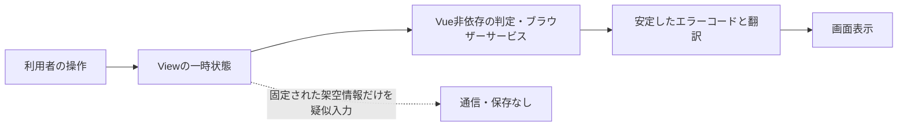
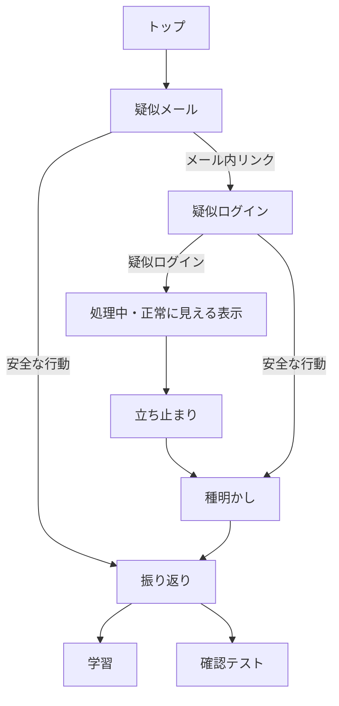

# アーキテクチャと安全設計

## 構成方針

表示文言、状態、純粋ロジック、型、静的な制御値を分離しています。UIはAtomic Designに沿って、atoms、molecules、organisms、templates、viewsへ分類します。画面間で保持すべき認証状態がないため、Piniaや永続ストレージは使用しません。

日本語専用の現在構成でも、画面に表示する文言は`src/i18n/locales/ja.json`へ集約し、Vue I18nから取得します。本文、ボタン、フォームラベル、ARIAラベル、ルートタイトル、学習・クイズなどの構造化文言が対象です。TypeScriptからは分割や結合をしていない完全な翻訳キーパスを指定します。URL、ルート名、問題ID、正解IDなど翻訳しない制御値は`config`で型付けします。

## 疑似体験フロー

各画面は前画面の状態へ依存せず、直接URLから開いても内容を理解できます。選択内容をURL、クエリ、ハッシュへ含めません。

## 非送信・非保存の根拠

- 疑似ログイン画面は`form`と`input`を使用せず、ボタン操作後に固定された架空のメールアドレスと伏字パスワードを`dl`で表示します。
- 疑似ログインボタンは認証処理を行わず、画面内の一時状態とタイマーだけで処理中・正常に見える表示を切り替えます。
- 待機完了後はVue Routerで立ち止まり画面へ移動し、利用者が「次へ」を選んだ場合だけ種明かしへ進みます。
- 待機中に画面を離れた場合はタイマーと疑似入力済み状態を破棄します。
- ソースに`fetch`、Axios、XMLHttpRequestを使うアプリコードはありません。
- Cookie、localStorage、sessionStorage、IndexedDB、Service Workerへ認証情報を書き込むコードはありません。
- Consoleや外部ログ、アクセス解析、エラー監視へ認証情報を渡しません。
- クイズ回答は`QuizView`のローカルstateだけで保持し、再読込で消去されます。

## セキュリティ境界

参考情報ページの外部リンクを利用者が明示的に開いた場合だけ、リンク先への通常のブラウザー通信が発生します。すべての外部リンクに`target="_blank"`と`rel="noopener noreferrer"`を付けています。

公開時にはCloudflare Workersが一般的なアクセスログを処理する可能性がありますが、本アプリは独自の分析・監視機能を持ちません。

Cloudflare Workers Static Assetsへ配布する`public/_headers`では、CSPによってスクリプトとスタイルを同一オリジンへ限定し、外部通信、フォーム送信、Worker、iframe埋め込みを禁止します。あわせてMIMEスニッフィング、リファラー送信、不要なブラウザー権限を制限します。CSPで`unsafe-inline`を許可しないため、動的な表示状態はインラインstyleではなく定義済みCSSクラスで表現します。

`wrangler.jsonc`では`dist`を静的アセットの配信対象とし、`not_found_handling`を`single-page-application`に設定します。存在しない静的ファイルへのナビゲーションには`index.html`を返し、その後Vue Routerがルートまたはアプリ内404画面を表示します。一般公開する本番`workers.dev` URLは明示的に有効化し、不要なバージョン別プレビューURLは無効化します。Workerコードやバックエンド処理は追加しません。

## アクセシビリティ

セマンティックなヘッダー、ナビゲーション、メイン、フッター、見出し階層を使用します。スキップリンク、明確なフォーカス表示、色以外の状態説明、ライブ領域、キーボード操作、`prefers-reduced-motion`を用意し、WCAG 2.1 AAを意識しています。クイズのラジオ選択肢はatomへ集約し、文字と余白を含むカード全体をラベルとして操作できます。
