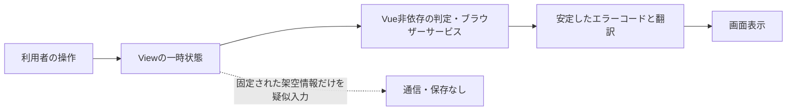
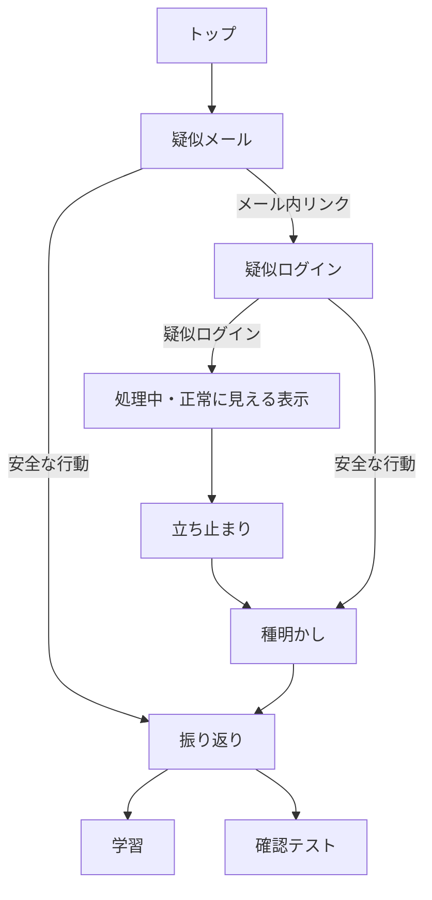

# アーキテクチャと安全設計

## 構成方針

表示文言、状態、純粋ロジック、型、静的な制御値を分離しています。UIはAtomic Designに沿って、atoms、molecules、organisms、templates、viewsへ分類します。画面間で保持すべき認証状態がないため、Piniaや永続ストレージは使用しません。

日本語専用の現在構成でも、画面に表示する文言は`src/i18n/locales/ja.json`へ集約し、Vue I18nから取得します。本文、ボタン、フォームラベル、ARIAラベル、ルートタイトル、学習・クイズなどの構造化文言が対象です。TypeScriptからは分割や結合をしていない完全な翻訳キーパスを指定します。URL、ルート名、問題ID、正解IDなど翻訳しない制御値は`config`で型付けします。

## 疑似体験フロー

各画面は前画面の状態へ依存せず、直接URLから開いても内容を理解できます。選択内容をURL、クエリ、ハッシュへ含めません。

## 非送信・非保存の根拠

- 疑似ログイン画面は`form`と`input`を使用せず、ボタン操作後に固定された架空のメールアドレスと伏字パスワードを`dl`で表示します。
- 疑似ログインボタンは認証処理を行わず、画面内の一時状態とタイマーだけで処理中・正常に見える表示を切り替えます。
- ソースに`fetch`、Axios、XMLHttpRequestを使うアプリコードはありません。

## セキュリティ境界

参考情報ページの外部リンクを利用者が明示的に開いた場合だけ、リンク先への通常のブラウザー通信が発生します。
